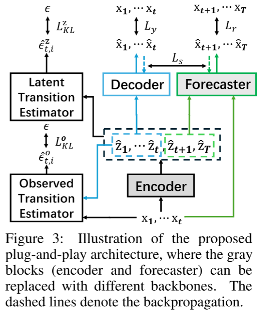
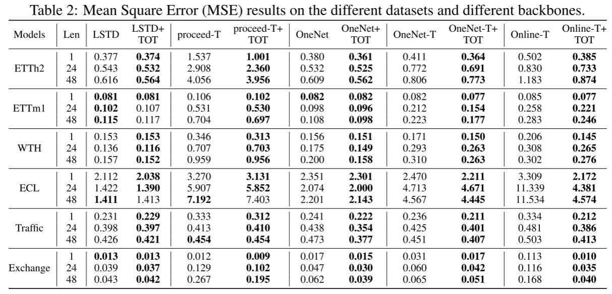
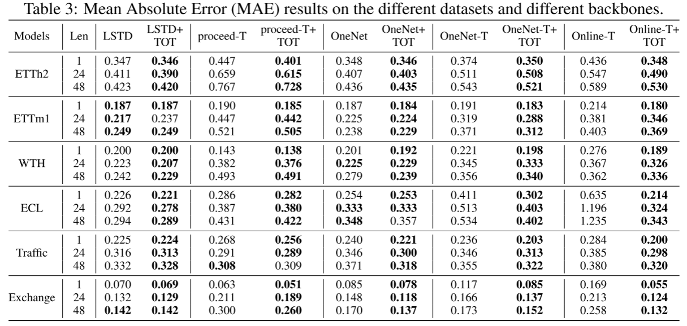

# (NeurIPS 2025) Online Time Series Forecasting with Theoretical Guarantees

This codebase is the official implementation of [`Online Time Series Forecasting with Theoretical Guarantees`](https://arxiv.org/abs/2309.12659) (**NeurIPS 2025**) 


## Abstract

This paper is concerned with online time series forecasting, where unknown dis-tribution shifts occur over time, i.e., latent variables influence the mapping fromhistorical to future observations. To develop an automated way of online timeseries forecasting, we propose a Theoretical framework for Online Time-seriesforecasting (TOT in short) with theoretical guarantees. Specifically, we prove thatsupplying a forecaster with latent variables tightens the Bayes risk-the beneftendures under estimation uncertainty of latent variables and grows as the latentvariables achieve a more precise identifability. To better introduce latent variablesinto online forecasting algorithms, we further propose to identify latent variableswith minimal adjacent observations. Based on these results, we devise a model-agnostic blueprint by employing a temporal decoder to match the distribution ofobserved variables and two independent noise estimators to model the causal infer.ence of latent variables and mixing procedures of observed variables, respectivelyExperiment results on synthetic data support our theoretical claims. Moreover, plugin implementations built on several baselines yield general improvement acrossmultiple benchmarks, highlighting the effectiveness in real-world applications.

<div align="center">
   
</div>

## Requirements

- einops==0.4.0
- matplotlib==3.7.2
- mkl_service==2.4.0
- numexpr==2.8.6
- numpy==1.23.5
- pandas==1.5.3
- scikit_learn==1.3.0
- scipy==1.10.1
- seaborn==0.13.2
- sympy==1.13.3
- torch==2.3.1
- torchvision==0.18.1
- tqdm==4.64.1
- wandb==0.22.2


## Reproducibility

### 1. Data preparation

We have already put the datasets in the .\TOT-main\data\ file.You just should unzip dataset and it can be used directly. 

### 2. Run experiments

To replicate our results, Run the following command example.
```
python loop.py -models onenet+TOT -len 24 -dataset Exchange -seed 2023 -device 0
```
The configuration details for the experiment can be found in the provided results log file.

### 3.  Arguments

You can specify one of the above method via the ```-models``` argument.

**Dataset:** Our current implementation is compatible with several datasets, including the Electricity Transformer dataset (ETT) – which comprises ETTh1, ETTh2, ETTm1, and ETTm2 – as well as ECL, Traffic, and WTH. The target dataset can be designated using the ```-dataset``` parameter.

**Other arguments:** Other useful arguments for experiments are:
- ```-test_bsz```: batch size used for testing: must be set to **1** for online learning,
- ```-len```: forecast windows' length
- ```-device```: Specify the graphics card number to run, e.g.: 0
## Results
The main results are shown in table 2 and table 3.

<p align="center">
  
  <br><br>
</p>

<p align="center">
  
  <br><br>
</p>

## License

This source code is released under the MIT license, included [here](LICENSE).

### Citation 
If you find this repo useful, please consider citing: 
```
@misc{li2025onlinetimeseriesforecasting,
      title={Online Time Series Forecasting with Theoretical Guarantees}, 
      author={Zijian Li and Changze Zhou and Minghao Fu and Sanjay Manjunath and Fan Feng and Guangyi Chen and Yingyao Hu and Ruichu Cai and Kun Zhang},
      year={2025},
      eprint={2510.18281},
      archivePrefix={arXiv},
      primaryClass={cs.LG},
      url={https://arxiv.org/abs/2510.18281}, 
}
```
